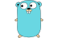

#  J0hn, at your service...

<h2>PROGRAMMING LANGUAGES</h2>

|   |   |
|:-:|:-:|
|Frontend||
|Backend||
|Systems||

<h2>TECHNOLOGIES</h2>

|   |   |   |   |   |   |
|:-:|:-:|:-:|:-:|:-:|:-:|
|Frontend||||
|Databases||||
|DevOps|||
|CLI||||
|Format||||

<h2>TOOLS</h2>

|   |   |   |   |
|:-:|:-:|:-:|:-:|
|Editors|||
|Platforms||||
|Terminals||
|BaaS|| |
|Diagramming||

<h2>OPERATING SYSTEMS</h2>

|   |   |   |
|:-:|:-:|:-:|
|Base|||
|Distros|||

<section align=center>
  <h2>STATS</h2>
  
  
</section>
 

 

  

<section align=right>
  <h2>CONTACT</h2>
  
  
</section>
 