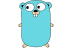
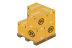

#  J0hn, at your service...

<h2>LANGUAGES</h2>

|   |   |
|:-:|:-:|
|Frontend||
|Backend||
|System||
|Database||

<h2>TECHNOLOGIES</h2>

|   |   |   |   |
|:-:|:-:|:-:|:-:|
|Frontend||||
|Databases|||
|DevOps|||
|CLI||||
|Format||||

<h2>TOOLS</h2>

|   |   |   |   |
|:-:|:-:|:-:|:-:|
|Editors|||
|Platforms||||
|Terminals||
|BaaS|| |
|Diagramming||

<h2>OPERATING SYSTEMS</h2>

|   |   |   |   |
|:-:|:-:|:-:|:-:|
|Base|||
|Distros||||

  <h2>STATS</h2>
  <table>
    <tr>
      <td>
        
         
        
      </td>
      <td valign="top">
        
      </td>
    </tr>
  </table>

<h2>Fav Code</h2>

  

<section align=right>
  <h2>CONTACT</h2>
  
  
</section>
 
